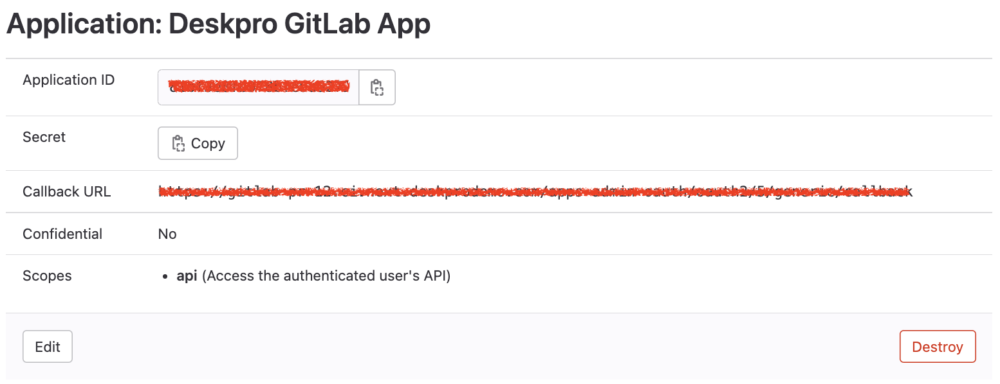

GitLab App Setup
===

To install the GitLab app you must first create an "Application ID" and "Secret".

Head over to GitLab and navigate to the "Edit profile" section (under your user profile menu, top right of the screen)

Go to the "Applications" section of the left-hand menu.

Enter the following details for your new Application:

* Application Name - "Deskpro GitLab App"
* Redirect URI - You can copy it in the GitLab settings on the settings tab
* Select permissions scopes - `read_api`

Then click "Save application"

On the next screen you can find note of your Application ID and Secret. **Keep these safe.**

Ok, head back to Deskpro and enter your Application ID and Secret into the app settings form.

Click on the "Permissions" tab and select the users/groups that you'd like to have access to the GitLab app.

When you're happy - click "Install".
